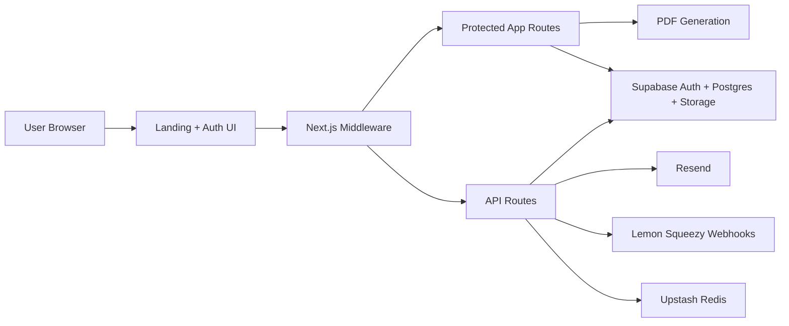
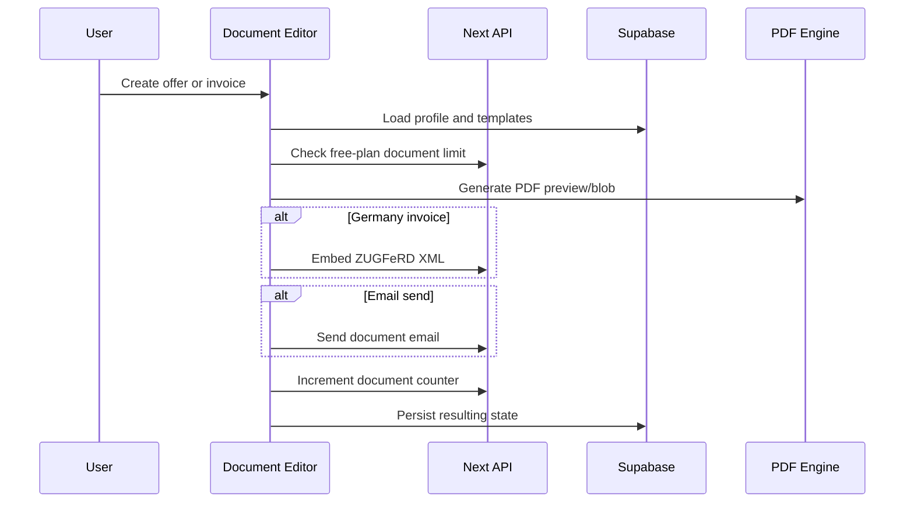

# Architecture

## Overview

Offertio is a single Next.js application that combines a marketing site, authenticated SaaS app, server-side API routes, and Supabase-backed data storage.

## Application Surfaces

### Public surface

- `/` marketing site
- `/login` authentication entry point
- `/callback` auth redirect handler
- `/datenschutz`, `/agb`, `/impressum`

### Protected surface

- `/onboarding`
- `/dashboard`
- `/dokument/neu`
- `/dokument/success`
- `/einstellungen/profil`
- `/einstellungen/vorlagen`

### API surface

- `/api/dokument/check-limit`
- `/api/send-offerte`
- `/api/e-rechnung/generate`
- `/api/account/delete`
- `/api/webhooks/lemon-squeezy`

## Repository Boundaries

### `src/app`

Contains all App Router routes, route groups, layouts, and server handlers.

- `(auth)` contains public auth/legal routes
- `(app)` contains authenticated product routes
- `api` contains mutation and integration endpoints

### `src/components`

Contains UI building blocks and presentation-specific logic, including:

- landing page sections
- upgrade screen
- offline indicator
- PDF component used for document rendering

### `src/lib`

Contains most domain and infrastructure logic:

- `dach.ts` country-specific compliance and tax rules
- `payment.ts` plan, pricing, and checkout URL helpers
- `profile.ts` profile completeness logic
- `security.ts` validation and origin-safety helpers
- `rate-limit.ts` rate limiting abstraction
- `qr-bill.ts` Swiss QR-bill generation helpers
- `zugferd-xml.ts` and `zugferd-embedder.ts` German e-invoice generation
- `supabase-*.ts` browser/server/admin clients

### `supabase/migrations`

Authoritative SQL migration history for the production schema.

## Auth and Access Control

Auth is handled by Supabase and enforced centrally in [`src/middleware.ts`](../src/middleware.ts).

Key rules:

- public routes are allowlisted
- all other routes require a valid Supabase session
- users are redirected to onboarding until `onboarding_complete = true`
- users missing required legal/company identifiers for their country are redirected to profile settings

This keeps compliance-sensitive profile completeness separate from account creation.

## Document Workflow

The core product workflow is:

Important implementation details:

- drafts are restored client-side for continuity
- the editor uses server-side limit checks before final send
- PDFs are generated from a React component and can then be post-processed
- Swiss QR-bill assets are only generated for Swiss invoices
- German ZUGFeRD generation is only used where legally relevant

## Country Logic

The DACH abstraction is one of the most important product decisions in the codebase.

`src/lib/dach.ts` centralizes:

- country-specific VAT labels and rates
- required tax/company fields
- QR-bill availability
- SEPA vs Swiss payment behavior
- ZUGFeRD relevance
- postcode length expectations
- whether `Leistungsdatum` is required

This prevents compliance logic from leaking throughout the UI.

## Database Model

Primary application tables:

### `profiles`

Stores:

- auth-linked user identity
- business details
- tax identifiers
- country and language
- plan state
- onboarding completion
- logo URL

### `vorlagen`

Stores reusable line-item templates linked to a user.

### `dokument_counter`

Stores server-side monthly document counts used to enforce the free-plan limit safely.

### `waitlist`

Legacy lead-capture table retained for historical/operational use. It is no longer the primary product funnel.

## Storage

Supabase Storage is used for uploaded company logos.

The production hardening migration added:

- a dedicated `logos` bucket
- storage policies
- safer upload boundaries

## Security Model

Security controls are layered rather than concentrated in a single place.

### Browser and transport

- strict response headers in [next.config.ts](C:/Users/resha/OneDrive/Desktop/Offertio/Offerte-claude-offertio-landing-page-oeati/next.config.ts)
- nonce-based CSP in middleware
- frame denial and strict transport settings

### Request validation

- allowed-origin checks on sensitive APIs
- payload size limits
- input normalization and validation
- safe document identifiers and base64 guards

### Abuse controls

- Upstash-backed rate limiting in production
- in-memory fallback for local development

### Data access

- Supabase row-level security
- service-role client isolated to server-only code
- HMAC validation on Lemon Squeezy webhooks

## Observability and Analytics

Analytics hooks exist for:

- CTA clicks
- login page views
- email capture
- onboarding completion
- document creation
- upgrade intent

The app supports:

- Vercel analytics
- GA4
- Meta Pixel

These are environment-controlled and remain optional.

## Current Architectural Strengths

- clear route separation between public, protected, and API concerns
- centralized country logic
- migration-backed schema evolution
- strong security posture for an early-stage SaaS
- good separation between browser, server, and admin Supabase clients

## Known Architectural Limits

- no browser-level E2E suite yet
- several premium flows depend on external service configuration
- some editor state still relies on client-side draft persistence for UX

These are normal for the current product stage but worth tracking as the product scales.
